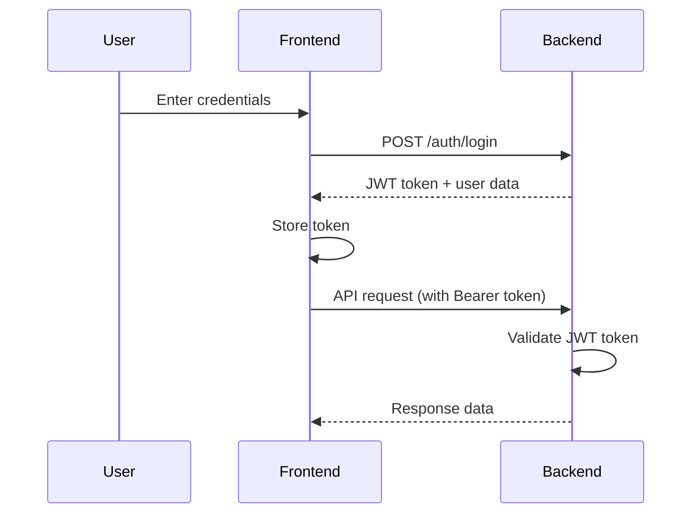
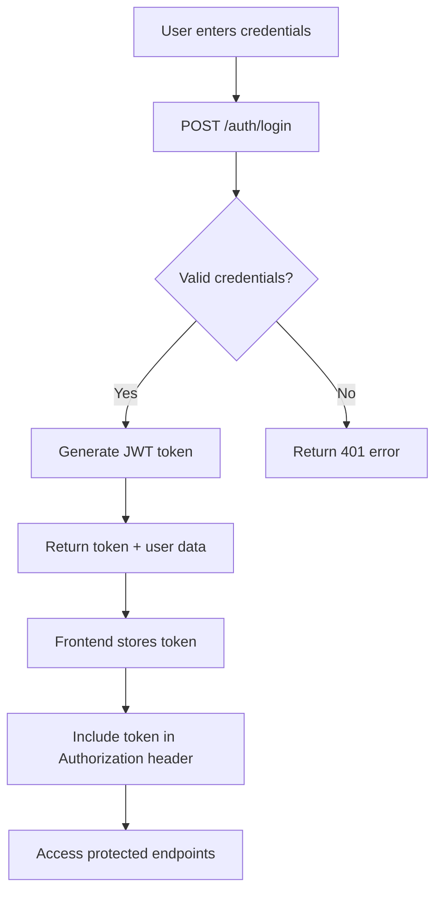
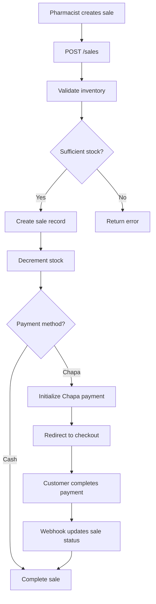
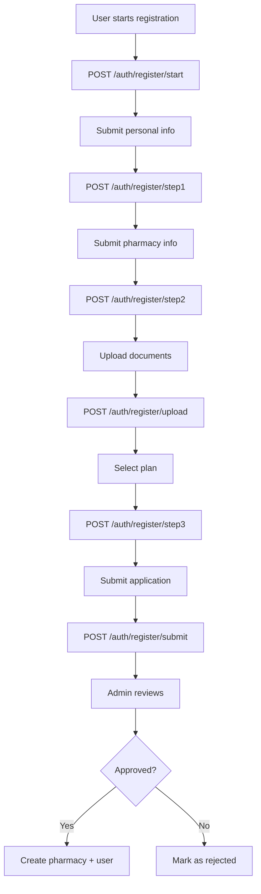

# PharmaCare Backend API Documentation

## Table of Contents

1. [Overview](#overview)
2. [API Base URLs](#api-base-urls)
3. [Authentication](#authentication)
4. [API Endpoints](#api-endpoints)
   - [Authentication Endpoints](#authentication-endpoints)
   - [Inventory Management](#inventory-management)
   - [Sales](#sales)
   - [Payments](#payments)
   - [Pharmacies & Branches](#pharmacies--branches)
   - [Users & Staff](#users--staff)
   - [Shifts](#shifts)
   - [Refunds & Stock Movements](#refunds--stock-movements)
   - [Import & Upload](#import--upload)
   - [Admin Endpoints](#admin-endpoints)
   - [Admin Subscriptions](#admin-subscriptions)
   - [Admin Documents](#admin-documents)
   - [Registration](#registration-public)
   - [Role-Based Endpoints](#role-based-endpoints)
5. [Frontend Integration Guide](#frontend-integration-guide)
6. [UI Update Procedures](#ui-update-procedures)
7. [System Flow](#system-flow)
8. [Error Handling](#error-handling)
9. [Rate Limiting & Pagination](#rate-limiting--pagination)
10. [Sample Code Snippets](#sample-code-snippets)

---

## Overview

The PharmaCare Backend API is a multi-tenant RESTful API designed for pharmacy management systems. It provides endpoints for managing inventory, sales, payments, users, branches, and subscriptions.

### Technology Stack

- **Runtime:** Node.js with Express.js
- **Database:** PostgreSQL (via Supabase)
- **Authentication:** JWT (JSON Web Tokens)
- **Payment Gateway:** Chapa (Ethiopian payment processor)
- **File Storage:** Supabase Storage

---

## API Base URLs

| Environment | URL |
|-------------|-----|
| Development | `http://localhost:3000/api` |
| Production | `https://backend-21.vercel.app/api` |

---

## Authentication

### Authentication Flow



### Token Management

The API uses JWT (JSON Web Tokens) for authentication. Tokens are included in the `Authorization` header:

```http
Authorization: Bearer <your-jwt-token>
```

**Token Expiration:** 7 days (configurable via `JWT_EXPIRES_IN` environment variable)

### Password Requirements

- Minimum 8 characters
- Passwords are hashed using bcrypt with salt factor 10

---

## API Endpoints

### Authentication Endpoints

| Method | Endpoint | Access | Description |
|--------|----------|--------|-------------|
| POST | [`/auth/register`](#post-authregister) | Public | Register a new user |
| POST | [`/auth/login`](#post-authlogin) | Public | Login and get token |
| POST | [`/auth/change-password`](#post-authchange-password) | Private | Change user password |
| POST | [`/auth/forgot-password`](#post-authforgot-password) | Public | Request password reset |
| POST | [`/auth/reset-password`](#post-authreset-password) | Public | Reset password with token |
| POST | [`/auth/logout`](#post-authlogout) | Private | Logout user |
| GET | [`/auth/me`](#get-authme) | Private | Get current user info |

#### POST /auth/register

Register a new user within a pharmacy.

**Request Body:**
```json
{
  "email": "user@pharmacy.com",
  "password": "password123",
  "fullName": "John Doe",
  "pharmacyId": 1,
  "roles": ["pharmacist"]
}
```

**Response (201 Created):**
```json
{
  "message": "User registered successfully",
  "token": "eyJhbGciOiJIUzI1NiIs...",
  "user": {
    "id": 1,
    "email": "user@pharmacy.com",
    "fullName": "John Doe",
    "pharmacyId": 1,
    "roles": ["pharmacist"]
  }
}
```

#### POST /auth/login

Authenticate a user and receive a JWT token.

**Request Body:**
```json
{
  "email": "user@pharmacy.com",
  "password": "password123"
}
```

**Response (200 OK):**
```json
{
  "message": "Login successful",
  "token": "eyJhbGciOiJIUzI1NiIs...",
  "user": {
    "id": 1,
    "email": "user@pharmacy.com",
    "fullName": "John Doe",
    "pharmacyId": 1,
    "roles": ["pharmacist"],
    "isOwner": false,
    "mustChangePassword": false
  }
}
```

#### POST /auth/change-password

Change the current user's password.

**Headers:** `Authorization: Bearer <token>`

**Request Body:**
```json
{
  "currentPassword": "oldPassword123",
  "newPassword": "newPassword456"
}
```

#### GET /auth/me

Get the current authenticated user's profile.

**Headers:** `Authorization: Bearer <token>`

**Response (200 OK):**
```json
{
  "id": 1,
  "email": "user@pharmacy.com",
  "fullName": "John Doe",
  "pharmacyId": 1,
  "roles": ["pharmacist"],
  "isOwner": false,
  "branches": [
    { "id": 1, "name": "Main Branch", "location": "Addis Ababa" }
  ],
  "isActive": true,
  "mustChangePassword": false
}
```

---

### Inventory Management

| Method | Endpoint | Access | Roles | Description |
|--------|----------|--------|-------|-------------|
| GET | [`/inventory/categories`](#get-inventorycategories) | Private | All | Get medicine categories |
| GET | [`/inventory/medicines`](#get-inventorymedicines) | Private | All | Get all medicines |
| POST | [`/inventory/medicines`](#post-inventorymedicines) | Private | Admin/Manager/Pharmacist | Add medicine |
| GET | [`/inventory/stocks`](#get-inventorystocks) | Private | All | Get stock levels |
| POST | [`/inventory/batches`](#post-inventorybatches) | Private | Admin/Manager/Pharmacist | Receive stock batch |

#### GET /inventory/categories

Get all medicine categories.

**Headers:** `Authorization: Bearer <token>`

**Response (200 OK):**
```json
[
  { "id": 1, "name": "Antibiotics" },
  { "id": 2, "name": "Pain Relief" }
]
```

---

### Sales

| Method | Endpoint | Access | Roles | Description |
|--------|----------|--------|-------|-------------|
| GET | [`/sales/payment-methods`](#get-salespayment-methods) | Private | All | Get payment methods |
| POST | [`/sales`](#post-sales) | Private | Admin/Manager/Pharmacist/Cashier | Create new sale |
| GET | [`/sales`](#get-sales) | Private | All | Get sales history |

#### GET /sales/payment-methods

Get available payment methods.

**Headers:** `Authorization: Bearer <token>`

**Response (200 OK):**
```json
[
  { "id": 1, "name": "Cash" },
  { "id": 2, "name": "Card" },
  { "id": 3, "name": "Chapa" }
]
```

#### POST /sales

Create a new sale.

**Headers:** `Authorization: Bearer <token>`

**Request Body:**
```json
{
  "branchId": 1,
  "customerName": "John Customer",
  "customerPhone": "+251911000000",
  "items": [
    { "medicineId": 1, "batchId": 1, "quantity": 2, "unitPrice": 150.00 }
  ],
  "paymentMethodId": 1,
  "discountAmount": 10.00,
  "taxAmount": 5.00,
  "isChapaPayment": false
}
```

**Response (201 Created):**
```json
{
  "id": 123,
  "branchId": 1,
  "customerName": "John Customer",
  "totalAmount": 300.00,
  "discountAmount": 10.00,
  "taxAmount": 5.00,
  "finalAmount": 295.00,
  "status": "COMPLETED"
}
```

#### GET /sales

Get sales history with optional filters.

**Headers:** `Authorization: Bearer <token>`

**Query Parameters:**
- `branchId` - Filter by branch
- `startDate` - Filter by start date (ISO format)
- `endDate` - Filter by end date (ISO format)

---

### Payments

| Method | Endpoint | Access | Description |
|--------|----------|--------|-------------|
| POST | [`/payments/chapa/initialize`](#post-paymentschapainitialize) | Private | Initialize Chapa payment |
| GET | [`/payments/chapa/verify/:txRef`](#get-paymentschapaverifytxref) | Private | Verify payment |
| POST | [`/payments/chapa/webhook`](#post-paymentschapawebhook) | Public | Handle Chapa webhook |
| GET | [`/payments/chapa/callback`](#get-paymentschapacallback) | Public | Handle payment callback |
| GET | [`/payments/chapa/return`](#get-paymentschapareturn) | Public | Handle payment return |
| GET | [`/payments/transactions`](#get-paymentstransactions) | Private | Get payment transactions |

#### POST /payments/chapa/initialize

Initialize a Chapa payment for a sale.

**Headers:** `Authorization: Bearer <token>`

**Request Body:**
```json
{
  "saleId": 123,
  "customerEmail": "customer@email.com",
  "customerFirstName": "John",
  "customerLastName": "Doe"
}
```

**Response (200 OK):**
```json
{
  "checkout_url": "https://checkout.chapa.co/...",
  "tx_ref": "TXF-123456"
}
```

#### GET /payments/chapa/verify/:txRef

Verify a payment transaction.

**Headers:** `Authorization: Bearer <token>`

**Response (200 OK):**
```json
{
  "success": true,
  "status": "success",
  "message": "Payment verified"
}
```

---

### Pharmacies & Branches

| Method | Endpoint | Access | Roles | Description |
|--------|----------|--------|-------|-------------|
| GET | [`/pharmacies`](#get-pharmacies) | Private | Admin | Get all pharmacies |
| GET | [`/pharmacies/my`](#get-pharmaciesmy) | Private | All | Get my pharmacy |
| PUT | [`/pharmacies/my`](#put-pharmaciesmy) | Private | Admin | Update pharmacy |
| GET | [`/pharmacies/branches`](#get-pharmaciesbranches) | Private | All | Get branches |
| POST | [`/pharmacies/branches`](#post-pharmaciesbranches) | Private | Admin | Create branch |
| PUT | [`/pharmacies/branches/:id`](#put-pharmaciesbranchesid) | Private | Admin | Update branch |

#### GET /pharmacies/my

Get the current user's pharmacy details.

**Headers:** `Authorization: Bearer <token>`

**Response (200 OK):**
```json
{
  "id": 1,
  "name": "My Pharmacy",
  "licenseNumber": "LIC-001",
  "address": "Addis Ababa, Ethiopia",
  "phone": "+251911000000",
  "email": "pharmacy@email.com",
  "branches": [
    { "id": 1, "name": "Main Branch", "location": "Addis Ababa" }
  ]
}
```

#### POST /pharmacies/branches

Create a new branch.

**Headers:** `Authorization: Bearer <token>`

**Request Body:**
```json
{
  "name": "Branch 2",
  "location": "Bahir Dar, Ethiopia",
  "phone": "+251911000001",
  "email": "branch2@pharmacy.com",
  "isMainBranch": false
}
```

---

### Users & Staff

| Method | Endpoint | Access | Roles | Description |
|--------|----------|--------|-------|-------------|
| GET | [`/users`](#get-users) | Private | Admin/Manager | Get all users |
| POST | [`/users`](#post-users) | Private | Admin | Create user |
| PUT | [`/users/:id`](#put-usersid) | Private | Admin | Update user |

#### GET /users

Get all users in the pharmacy.

**Headers:** `Authorization: Bearer <token>`

**Response (200 OK):**
```json
[
  {
    "id": 1,
    "email": "admin@pharmacy.com",
    "fullName": "Admin User",
    "isActive": true,
    "roles": ["admin"],
    "branches": [{ "id": 1, "name": "Main Branch" }]
  }
]
```

#### POST /users

Create a new user.

**Headers:** `Authorization: Bearer <token>`

**Request Body:**
```json
{
  "email": "newuser@pharmacy.com",
  "password": "password123",
  "fullName": "New User",
  "roles": ["pharmacist"],
  "branchIds": [1, 2]
}
```

---

### Shifts

| Method | Endpoint | Access | Description |
|--------|----------|--------|-------------|
| POST | [`/shifts/start`](#post-shiftsstart) | Private | Start cashier shift |
| POST | [`/shifts/end`](#post-shiftsend) | Private | End cashier shift |

#### POST /shifts/start

Start a new cashier shift.

**Headers:** `Authorization: Bearer <token>`

**Request Body:**
```json
{
  "branchId": 1,
  "openingBalance": 1000.00
}
```

**Response (201 Created):**
```json
{
  "id": 1,
  "userId": 1,
  "branchId": 1,
  "openingBalance": 1000.00,
  "status": "OPEN",
  "openedAt": "2024-01-15T08:00:00Z"
}
```

#### POST /shifts/end

End the current cashier shift.

**Headers:** `Authorization: Bearer <token>`

**Request Body:**
```json
{
  "closingBalance": 5000.00,
  "notes": "Shift completed"
}
```

**Response (200 OK):**
```json
{
  "shift": { "id": 1, "status": "CLOSED" },
  "summary": {
    "openingBalance": 1000.00,
    "totalSales": 3500.00,
    "expectedBalance": 4500.00,
    "closingBalance": 5000.00,
    "difference": 500.00
  }
}
```

---

### Refunds & Stock Movements

| Method | Endpoint | Access | Roles | Description |
|--------|----------|--------|-------|-------------|
| POST | [`/refunds`](#post-refunds) | Private | Admin/Manager/Pharmacist | Create refund |
| POST | [`/refunds/movements`](#post-refundsmovements) | Private | Admin/Manager/Pharmacist | Record stock movement |

#### POST /refunds

Process a refund for a sale.

**Headers:** `Authorization: Bearer <token>`

**Request Body:**
```json
{
  "saleId": 123,
  "reason": "Customer returned item",
  "items": [
    { "medicineId": 1, "quantity": 1, "unitPrice": 150.00 }
  ]
}
```

#### POST /refunds/movements

Record stock movements (transfer, adjustment, etc.).

**Headers:** `Authorization: Bearer <token>`

**Request Body:**
```json
{
  "medicineId": 1,
  "branchId": 1,
  "quantity": 50,
  "type": "TRANSFER",
  "targetBranchId": 2,
  "reason": "Stock rebalancing"
}
```

**Movement Types:**
- `IN` - Stock received
- `OUT` - Stock removed
- `ADJUSTMENT` - Manual stock adjustment
- `TRANSFER` - Transfer between branches

**Response (200 OK):**
```json
{
  "message": "Stock movement recorded",
  "type": "TRANSFER",
  "quantity": 50,
  "newQuantity": 950
}
```

---

### Import & Upload

| Method | Endpoint | Access | Roles | Description |
|--------|----------|--------|-------|-------------|
| POST | [`/import/medicines`](#post-importmedicines) | Private | Admin/Manager/Pharmacist | Import medicines from Excel/CSV |
| POST | [`/import/stock`](#post-importstock) | Private | Admin/Manager/Pharmacist | Import stock from Excel/CSV |
| GET | [`/import/template/medicines`](#get-importtemplatemedicines) | Private | Admin/Manager/Pharmacist | Download medicine template |
| GET | [`/import/template/stock`](#get-importtemplatestock) | Private | Admin/Manager/Pharmacist | Download stock template |
| POST | [`/upload/document`](#post-uploaddocument) | Private | All | Upload document |
| GET | [`/upload/documents`](#get-uploaddocuments) | Private | All | Get uploaded documents |

#### POST /import/medicines

Import medicines from Excel or CSV file.

**Headers:** `Authorization: Bearer <token>`
**Content-Type:** `multipart/form-data`

**Form Data:**
- `file` - Excel (.xlsx) or CSV file
- `branchId` (optional) - Target branch ID
- `createCategories` (optional) - Create new categories (default: true)
- `skipDuplicates` (optional) - Skip duplicate medicines (default: true)

**Response (200 OK):**
```json
{
  "success": true,
  "summary": {
    "total": 100,
    "imported": 95,
    "skipped": 3,
    "failed": 2
  },
  "imported": [...],
  "failed": [...]
}
```

---

### Admin Endpoints

| Method | Endpoint | Access | Roles | Description |
|--------|----------|--------|-------|-------------|
| GET | [`/admin/dashboard`](#get-admindashboard) | Private | Admin | Get admin dashboard |
| GET | [`/admin/managers`](#get-adminmanagers) | Private | Admin | Get all managers |
| PUT | [`/admin/managers/:id/activate`](#put-adminmanagersidactivate) | Private | Admin | Activate manager |
| PUT | [`/admin/managers/:id/deactivate`](#put-adminmanagersiddeactivate) | Private | Admin | Deactivate manager |
| GET | [`/admin/branches`](#get-adminbranches) | Private | Admin | Get all branches |
| POST | [`/admin/branches`](#post-adminbranches) | Private | Admin | Create branch |
| PUT | [`/admin/branches/:id`](#put-adminbranchesid) | Private | Admin | Update branch |
| DELETE | [`/admin/branches/:id`](#delete-adminbranchesid) | Private | Admin | Delete branch |

#### GET /admin/dashboard

Get system-wide admin dashboard.

**Headers:** `Authorization: Bearer <token>`

**Response (200 OK):**
```json
{
  "totalPharmacies": 50,
  "activePharmacies": 45,
  "totalBranches": 120,
  "totalUsers": 500,
  "totalRevenue": 1500000.00,
  "recentActivity": [...]
}
```

---

### Role-Based Endpoints

#### Manager Endpoints

| Method | Endpoint | Description |
|--------|----------|-------------|
| GET | [`/manager/dashboard`](#get-managerdashboard) | Get manager dashboard |
| GET | [`/manager/staff`](#get-managerstaff) | Get staff list |
| POST | [`/manager/staff`](#post-managerstaff) | Create staff member |
| PUT | [`/manager/staff/:id`](#put-managerstaffid) | Update staff member |
| PUT | [`/manager/staff/:id/activate`](#put-managerstaffidactivate) | Activate staff |
| PUT | [`/manager/staff/:id/deactivate`](#put-managerstaffiddeactivate) | Deactivate staff |
| GET | [`/manager/medicines`](#get-managermedicines) | Get medicines |
| POST | [`/manager/medicines`](#post-managermedicines) | Add medicine |

#### Pharmacist Endpoints

| Method | Endpoint | Description |
|--------|----------|-------------|
| GET | [`/pharmacist/dashboard`](#get-pharmacistdashboard) | Get pharmacist dashboard |
| GET | [`/pharmacist/sales`](#get-pharmacistsales) | Get sales |
| POST | [`/pharmacist/sales`](#post-pharmacistsales) | Create sale |
| POST | [`/pharmacist/handoff-to-cashier`](#post-pharmacisthandoff-to-cashier) | Hand off to cashier |
| GET | [`/pharmacist/inventory`](#get-pharmacistinventory) | Get inventory |
| POST | [`/pharmacist/inventory/restock-request`](#post-pharmacistinventoryrestock-request) | Request restock |
| GET | [`/pharmacist/reports`](#get-pharmacistreports) | Get reports |

#### Cashier Endpoints

| Method | Endpoint | Description |
|--------|----------|-------------|
| GET | [`/cashier/dashboard`](#get-cashierdashboard) | Get cashier dashboard |
| GET | [`/cashier/payments`](#get-cashierpayments) | Get pending payments |
| POST | [`/cashier/payments/:id/accept`](#post-cashierpaymentsidaccept) | Accept payment |
| GET | [`/cashier/receipts`](#get-cashierreceipts) | Get receipts |
| GET | [`/cashier/receipts/:id`](#get-cashierreceiptsid) | Get receipt details |
| GET | [`/cashier/returns`](#get-cashierreturns) | Get returns |
| POST | [`/cashier/returns`](#post-cashierreturns) | Process return |
| GET | [`/cashier/reports`](#get-cashierreports) | Get reports |

---

### Registration (Public)

| Method | Endpoint | Access | Description |
|--------|----------|--------|-------------|
| POST | [`/auth/register/start`](#post-authregisterstart) | Public | Start registration |
| POST | [`/auth/register/step1`](#post-authregisterstep1) | Public | Submit step 1 (personal info) |
| POST | [`/auth/register/step2`](#post-authregisterstep2) | Public | Submit step 2 (pharmacy info) |
| POST | [`/auth/register/upload`](#post-authregisterupload) | Public | Upload documents |
| POST | [`/auth/register/step3`](#post-authregisterstep3) | Public | Select plan |
| POST | [`/auth/register/submit`](#post-authregistersubmit) | Public | Submit application |
| GET | [`/auth/register/status/:applicationId`](#get-authregisterstatusapplicationid) | Public | Check status by ID |
| GET | [`/auth/register/status/email/:email`](#get-authregisterstatusemail-email) | Public | Check status by email |

#### POST /auth/register/start

Start a new registration application.

**Request Body:**
```json
{
  "email": "newpharmacy@email.com"
}
```

**Response (201 Created):**
```json
{
  "message": "Registration started",
  "applicationId": 1,
  "currentStep": 1
}
```

#### POST /auth/register/step1

Submit personal information.

**Request Body:**
```json
{
  "applicationId": 1,
  "fullName": "John Doe",
  "phone": "+251911000000",
  "password": "password123"
}
```

#### POST /auth/register/step2

Submit pharmacy information.

**Request Body:**
```json
{
  "applicationId": 1,
  "pharmacyName": "My Pharmacy",
  "pharmacyAddress": "Addis Ababa, Ethiopia",
  "pharmacyPhone": "+251911000001",
  "pharmacyEmail": "pharmacy@email.com",
  "licenseNumber": "LIC-001",
  "tinNumber": "TIN-001"
}
```

#### POST /auth/register/upload

Upload registration documents.

**Content-Type:** `multipart/form-data`

**Form Data:**
- `applicationId` - Application ID
- `documentType` - "license" or "fyda"
- `document` - File

#### POST /auth/register/step3

Select subscription plan.

**Request Body:**
```json
{
  "applicationId": 1,
  "planId": 1
}
```

#### POST /auth/register/submit

Submit the application for review.

**Request Body:**
```json
{
  "applicationId": 1
}
```

#### GET /auth/register/status/:applicationId

Check application status by ID.

**Response (200 OK):**
```json
{
  "id": 1,
  "email": "newpharmacy@email.com",
  "fullName": "John Doe",
  "pharmacyName": "My Pharmacy",
  "currentStep": 4,
  "status": "submitted",
  "selectedPlan": { "id": 1, "name": "Basic" },
  "createdAt": "2024-01-15T08:00:00Z"
}
```

#### GET /auth/register/status/email/:email

Check application status by email.

**Response (200 OK):**
```json
{
  "id": 1,
  "email": "newpharmacy@email.com",
  "fullName": "John Doe",
  "currentStep": 4,
  "status": "submitted",
  "rejectionReason": null,
  "createdAt": "2024-01-15T08:00:00Z"
}
```

---

### Admin Subscriptions

| Method | Endpoint | Access | Description |
|--------|----------|--------|-------------|
| GET | [`/admin/subscriptions/plans`](#get-adminsubscriptionsplans) | Public | Get active subscription plans |
| GET | [`/admin/subscriptions/plans/all`](#get-adminsubscriptionsplansall) | Admin | Get all plans |
| POST | [`/admin/subscriptions/plans`](#post-adminsubscriptionsplans) | Admin | Create plan |
| PUT | [`/admin/subscriptions/plans/:id`](#put-adminsubscriptionsplansid) | Admin | Update plan |
| DELETE | [`/admin/subscriptions/plans/:id`](#delete-adminsubscriptionsplansid) | Admin | Deactivate plan |
| GET | [`/admin/subscriptions/applications`](#get-adminsubscriptionsapplications) | Admin | Get registration applications |
| GET | [`/admin/subscriptions/applications/:id`](#get-adminsubscriptionsapplicationsid) | Admin | Get application details |
| POST | [`/admin/subscriptions/applications/:id/approve`](#post-adminsubscriptionsapplicationsidapprove) | Admin | Approve application |
| POST | [`/admin/subscriptions/applications/:id/reject`](#post-adminsubscriptionsapplicationsidreject) | Admin | Reject application |

#### GET /admin/subscriptions/plans

Get all active subscription plans (public endpoint for registration).

**Response (200 OK):**
```json
[
  {
    "id": 1,
    "name": "Basic",
    "description": "For small pharmacies",
    "price": 500,
    "currency": "ETB",
    "billingCycle": "monthly",
    "maxBranches": 1,
    "maxStaffPerBranch": 5,
    "maxMedicines": 100,
    "features": { "support": "email" }
  }
]
```

#### GET /admin/subscriptions/applications

Get all registration applications.

**Headers:** `Authorization: Bearer <token>`

**Query Parameters:**
- `status` - Filter by status (draft, submitted, approved, rejected)

#### POST /admin/subscriptions/applications/:id/approve

Approve a registration application. This creates the pharmacy, user, and branch.

**Headers:** `Authorization: Bearer <token>`

**Response (200 OK):**
```json
{
  "message": "Application approved successfully",
  "pharmacy": { "id": 1, "name": "My Pharmacy" },
  "user": { "id": 1, "email": "user@email.com", "fullName": "John Doe" },
  "trialEndsAt": "2024-02-15T00:00:00Z",
  "loginToken": "eyJhbGciOiJIUzI1NiIs..."
}
```

#### POST /admin/subscriptions/applications/:id/reject

Reject a registration application.

**Headers:** `Authorization: Bearer <token>`

**Request Body:**
```json
{
  "reason": "Invalid license document"
}
```

---

### Admin Documents

| Method | Endpoint | Access | Description |
|--------|----------|--------|-------------|
| GET | [`/admin/documents/pending`](#get-admindocumentspending) | Admin | Get pending documents |
| GET | [`/admin/documents/all`](#get-admindocumentsall) | Admin | Get all documents |
| PUT | [`/admin/documents/:id/verify`](#put-admindocumentsidverify) | Admin | Verify document |
| PUT | [`/admin/documents/:id/reject`](#put-admindocumentsidreject) | Admin | Reject document |

#### GET /admin/documents/pending

Get all documents pending verification.

**Headers:** `Authorization: Bearer <token>`

**Response (200 OK):**
```json
[
  {
    "id": 1,
    "documentType": "license",
    "fileName": "license.pdf",
    "fileUrl": "https://...",
    "verificationStatus": "pending",
    "pharmacy": { "id": 1, "name": "My Pharmacy" }
  }
]
```

#### PUT /admin/documents/:id/verify

Verify a document.

**Headers:** `Authorization: Bearer <token>`

**Response (200 OK):**
```json
{
  "message": "Document verified successfully"
}
```

#### PUT /admin/documents/:id/reject

Reject a document.

**Headers:** `Authorization: Bearer <token>`

**Request Body:**
```json
{
  "reason": "Document is blurry and unreadable"
}
```

---

## Frontend Integration Guide

### Setting Up API Client

#### Using Fetch API

```javascript
const API_BASE_URL = 'https://backend-21.vercel.app/api';

class ApiClient {
  constructor() {
    this.baseUrl = API_BASE_URL;
  }

  getToken() {
    return localStorage.getItem('token');
  }

  async request(endpoint, options = {}) {
    const token = this.getToken();
    const headers = {
      'Content-Type': 'application/json',
      ...options.headers,
    };

    if (token) {
      headers['Authorization'] = `Bearer ${token}`;
    }

    const response = await fetch(`${this.baseUrl}${endpoint}`, {
      ...options,
      headers,
    });

    if (response.status === 401) {
      // Token expired or invalid
      localStorage.removeItem('token');
      window.location.href = '/login';
      throw new Error('Session expired');
    }

    const data = await response.json();

    if (!response.ok) {
      throw new Error(data.error || 'Request failed');
    }

    return data;
  }

  get(endpoint) {
    return this.request(endpoint, { method: 'GET' });
  }

  post(endpoint, body) {
    return this.request(endpoint, {
      method: 'POST',
      body: JSON.stringify(body),
    });
  }

  put(endpoint, body) {
    return this.request(endpoint, {
      method: 'PUT',
      body: JSON.stringify(body),
    });
  }

  delete(endpoint) {
    return this.request(endpoint, { method: 'DELETE' });
  }
}

export const api = new ApiClient();
```

#### Using Axios

```javascript
import axios from 'axios';

const API_BASE_URL = 'https://backend-21.vercel.app/api';

const api = axios.create({
  baseURL: API_BASE_URL,
  headers: {
    'Content-Type': 'application/json',
  },
});

// Request interceptor
api.interceptors.request.use(
  (config) => {
    const token = localStorage.getItem('token');
    if (token) {
      config.headers.Authorization = `Bearer ${token}`;
    }
    return config;
  },
  (error) => Promise.reject(error)
);

// Response interceptor
api.interceptors.response.use(
  (response) => response,
  (error) => {
    if (error.response?.status === 401) {
      localStorage.removeItem('token');
      window.location.href = '/login';
    }
    return Promise.reject(error);
  }
);

export default api;
```

### Authentication Flow

```javascript
// Login
const login = async (email, password) => {
  try {
    const response = await api.post('/auth/login', { email, password });
    const { token, user } = response;
    
    localStorage.setItem('token', token);
    localStorage.setItem('user', JSON.stringify(user));
    
    return user;
  } catch (error) {
    console.error('Login failed:', error.message);
    throw error;
  }
};

// Logout
const logout = () => {
  localStorage.removeItem('token');
  localStorage.removeItem('user');
  window.location.href = '/login';
};

// Get current user
const getCurrentUser = async () => {
  const response = await api.get('/auth/me');
  return response;
};
```

### Making API Requests

```javascript
// Get medicines
const getMedicines = async () => {
  return await api.get('/inventory/medicines');
};

// Create a sale
const createSale = async (saleData) => {
  return await api.post('/sales', saleData);
};

// Initialize payment
const initializePayment = async (paymentData) => {
  return await api.post('/payments/chapa/initialize', paymentData);
};
```

---

## UI Update Procedures

### Cache Invalidation

When data changes on the server, the frontend should invalidate relevant caches:

```javascript
// Cache keys
const CACHE_KEYS = {
  MEDICINES: 'medicines_cache',
  SALES: 'sales_cache',
  INVENTORY: 'inventory_cache',
  USERS: 'users_cache',
};

// Clear specific cache
const invalidateCache = (key) => {
  localStorage.removeItem(key);
};

// Clear all caches
const clearAllCaches = () => {
  Object.values(CACHE_KEYS).forEach(key => invalidateCache(key));
};

// After mutations, invalidate relevant caches
const handleSaleCreated = () => {
  invalidateCache(CACHE_KEYS.SALES);
  invalidateCache(CACHE_KEYS.INVENTORY);
  // Refresh data
  fetchSales();
};
```

### Handling Real-Time Updates

Since this API doesn't use WebSockets, implement polling for real-time data:

```javascript
// Polling utility
const createPoller = (interval, callback) => {
  let isPolling = false;
  let timerId = null;

  const start = () => {
    if (isPolling) return;
    isPolling = true;
    poll();
  };

  const stop = () => {
    isPolling = false;
    if (timerId) clearInterval(timerId);
  };

  const poll = async () => {
    if (!isPolling) return;
    try {
      await callback();
    } catch (error) {
      console.error('Polling error:', error);
    }
    timerId = setTimeout(poll, interval);
  };

  return { start, stop };
};

// Usage for sales dashboard
const salesPoller = createPoller(30000, async () => {
  const sales = await api.get('/sales');
  updateSalesUI(sales);
});

// Start polling when component mounts
salesPoller.start();

// Stop when component unmounts
salesPoller.stop();
```

### Optimistic UI Updates

For better user experience, implement optimistic updates:

```javascript
const createOptimisticUpdate = async (
  apiCall,
  updateStore,
  rollbackOnError = true
) => {
  const previousState = getStoreState();

  // Optimistically update UI
  updateStore();

  try {
    await apiCall();
  } catch (error) {
    if (rollbackOnError) {
      // Rollback on error
      setStoreState(previousState);
    }
    throw error;
  }
};

// Example: Optimistic sale creation
const createSaleOptimistic = async (saleData) => {
  const previousSales = sales;

  // Optimistically add sale to UI
  const optimisticSale = { ...saleData, id: 'temp-' + Date.now() };
  setSales([optimisticSale, ...sales]);

  try {
    const response = await api.post('/sales', saleData);
    // Replace optimistic sale with real one
    setSales(sales.map(s => 
      s.id === optimisticSale.id ? response : s
    ));
  } catch (error) {
    // Rollback
    setSales(previousSales);
    throw error;
  }
};
```

---

## System Flow

### User Authentication Flow



### Sale Processing Flow



### Registration Flow



---

## Error Handling

### HTTP Status Codes

| Code | Description |
|------|-------------|
| 200 | Success |
| 201 | Created |
| 400 | Bad Request - Invalid input |
| 401 | Unauthorized - Authentication required |
| 403 | Forbidden - Insufficient permissions |
| 404 | Not Found - Resource doesn't exist |
| 409 | Conflict - Duplicate entry |
| 413 | Payload Too Large - File too big |
| 429 | Too Many Requests - Rate limit exceeded |
| 500 | Internal Server Error |

### Error Response Format

```json
{
  "error": "Error message description"
}
```

### Common Error Codes

| Error | Code | Description | Solution |
|-------|------|-------------|----------|
| Invalid credentials | 401 | Email or password incorrect | Verify credentials |
| Token expired | 401 | JWT token has expired | Re-authenticate |
| No token | 401 | No token provided | Include token in header |
| Insufficient permissions | 403 | User role doesn't have access | Check user roles |
| Not found | 404 | Resource doesn't exist | Verify resource ID |
| Missing fields | 400 | Required fields missing | Check request body |
| Rate limited | 429 | Too many requests | Wait and retry |

### Handling Errors in Frontend

```javascript
// Global error handler
api.interceptors.response.use(
  (response) => response,
  (error) => {
    const errorMessage = error.response?.data?.error || error.message;
    
    switch (error.response?.status) {
      case 401:
        toast.error('Session expired. Please login again.');
        logout();
        break;
      case 403:
        toast.error('You do not have permission to perform this action.');
        break;
      case 404:
        toast.error('Resource not found.');
        break;
      case 429:
        toast.error('Too many requests. Please wait a moment.');
        break;
      default:
        toast.error(errorMessage || 'An error occurred.');
    }
    
    return Promise.reject(error);
  }
);
```

---

## Rate Limiting & Pagination

### Rate Limiting

The API implements rate limiting to prevent abuse:

| Endpoint Type | Limit | Window |
|---------------|-------|--------|
| Authentication | 5 requests | 15 minutes |
| General API | 100 requests | 15 minutes |
| Webhooks | 50 requests | 1 minute |

**Rate Limit Headers:**
- `Retry-After` - Seconds until reset (when limited)

**Response (429 Too Many Requests):**
```json
{
  "error": "Too many requests, please try again later",
  "retryAfter": 120
}
```

### Pagination

For list endpoints, use query parameters:

```
GET /users?page=1&limit=20
```

| Parameter | Default | Max |
|-----------|---------|-----|
| page | 1 | - |
| limit | 20 | 100 |

**Response Format:**
```json
{
  "data": [...],
  "pagination": {
    "page": 1,
    "limit": 20,
    "total": 100,
    "totalPages": 5
  }
}
```

---

## Sample Code Snippets

### React Integration

```jsx
import React, { useState, useEffect, createContext, useContext } from 'react';
import api from './api';

// Auth Context
const AuthContext = createContext(null);

export const AuthProvider = ({ children }) => {
  const [user, setUser] = useState(null);
  const [loading, setLoading] = useState(true);

  useEffect(() => {
    const token = localStorage.getItem('token');
    if (token) {
      api.get('/auth/me')
        .then(setUser)
        .catch(() => logout())
        .finally(() => setLoading(false));
    } else {
      setLoading(false);
    }
  }, []);

  const login = async (email, password) => {
    const response = await api.post('/auth/login', { email, password });
    localStorage.setItem('token', response.token);
    setUser(response.user);
    return response.user;
  };

  const logout = () => {
    localStorage.removeItem('token');
    setUser(null);
  };

  return (
    <AuthContext.Provider value={{ user, login, logout, loading }}>
      {children}
    </AuthContext.Provider>
  );
};

export const useAuth = () => useContext(AuthContext);

// Protected Route Component
const ProtectedRoute = ({ children, roles }) => {
  const { user, loading } = useAuth();

  if (loading) return <div>Loading...</div>;

  if (!user) {
    return <Navigate to="/login" />;
  }

  if (roles && !roles.some(r => user.roles.includes(r))) {
    return <Navigate to="/unauthorized" />;
  }

  return children;
};

// Usage
const MedicinesPage = () => {
  const [medicines, setMedicines] = useState([]);
  const [loading, setLoading] = useState(true);

  useEffect(() => {
    api.get('/inventory/medicines')
      .then(setMedicines)
      .catch(console.error)
      .finally(() => setLoading(false));
  }, []);

  if (loading) return <div>Loading medicines...</div>;

  return (
    <div>
      <h1>Medicines</h1>
      {medicines.map(med => (
        <div key={med.id}>{med.name}</div>
      ))}
    </div>
  );
};

// Protected Route Usage
<ProtectedRoute roles={['admin', 'manager', 'pharmacist']}>
  <MedicinesPage />
</ProtectedRoute>
```

### Vue 3 Integration

```javascript
// composables/useApi.js
import { ref } from 'vue';
import api from './api';

export function useApi() {
  const loading = ref(false);
  const error = ref(null);

  const execute = async (fn) => {
    loading.value = true;
    error.value = null;
    try {
      return await fn();
    } catch (e) {
      error.value = e.response?.data?.error || e.message;
      throw e;
    } finally {
      loading.value = false;
    }
  };

  return { loading, error, execute };
}

// composables/useAuth.js
import { ref, computed } from 'vue';
import { useRouter } from 'vue-router';
import api from './api';

export function useAuth() {
  const user = ref(null);
  const router = useRouter();

  const login = async (email, password) => {
    const response = await api.post('/auth/login', { email, password });
    localStorage.setItem('token', response.token);
    user.value = response.user;
    return response.user;
  };

  const logout = () => {
    localStorage.removeItem('token');
    user.value = null;
    router.push('/login');
  };

  const fetchUser = async () => {
    try {
      user.value = await api.get('/auth/me');
    } catch {
      logout();
    }
  };

  const isAuthenticated = computed(() => !!user.value);

  return { user, login, logout, fetchUser, isAuthenticated };
}

// Component usage
<script setup>
import { onMounted } from 'vue';
import { useApi } from './composables/useApi';
import { useAuth } from './composables/useAuth';

const { loading, error, execute } = useApi();
const { user } = useAuth();

const medicines = ref([]);

const fetchMedicines = async () => {
  medicines.value = await execute(() => api.get('/inventory/medicines'));
};

onMounted(fetchMedicines);
</script>

<template>
  <div>
    <div v-if="loading">Loading...</div>
    <div v-else-if="error">{{ error }}</div>
    <div v-else>
      <div v-for="med in medicines" :key="med.id">
        {{ med.name }}
      </div>
    </div>
  </div>
</template>
```

### Handling File Uploads

```javascript
// Upload document
const uploadDocument = async (file, documentType) => {
  const formData = new FormData();
  formData.append('file', file);
  formData.append('documentType', documentType);

  const response = await fetch(`${API_BASE_URL}/upload/document`, {
    method: 'POST',
    headers: {
      'Authorization': `Bearer ${localStorage.getItem('token')}`,
    },
    body: formData,
  });

  return response.json();
};

// Import medicines from file
const importMedicines = async (file, branchId) => {
  const formData = new FormData();
  formData.append('file', file);
  if (branchId) {
    formData.append('branchId', branchId);
  }

  const response = await fetch(`${API_BASE_URL}/import/medicines`, {
    method: 'POST',
    headers: {
      'Authorization': `Bearer ${localStorage.getItem('token')}`,
    },
    body: formData,
  });

  return response.json();
};
```

### Handling Payment Flow

```javascript
// Complete payment flow
const handlePayment = async (saleId, customerInfo) => {
  try {
    // 1. Initialize payment
    const { checkout_url, tx_ref } = await api.post('/payments/chapa/initialize', {
      saleId,
      customerEmail: customerInfo.email,
      customerFirstName: customerInfo.firstName,
      customerLastName: customerInfo.lastName,
    });

    // 2. Redirect to Chapa checkout
    window.location.href = checkout_url;
    
    // Note: After payment, user will be redirected back via callback URL
    // The sale status will be updated via webhook
  } catch (error) {
    console.error('Payment initialization failed:', error);
    throw error;
  }
};

// Verify payment status
const verifyPayment = async (txRef) => {
  try {
    const result = await api.get(`/payments/chapa/verify/${txRef}`);
    return result;
  } catch (error) {
    console.error('Payment verification failed:', error);
    throw error;
  }
};
```

---

## Version Information

- **API Version:** v1 (current)
- **Base Path:** `/api`
- **Document Version:** 1.0.0
- **Last Updated:** 2024

---

## Support

For API-related questions or issues:
- Email: support@pharmacaref.com
- Documentation: https://docs.pharmacaref.com
